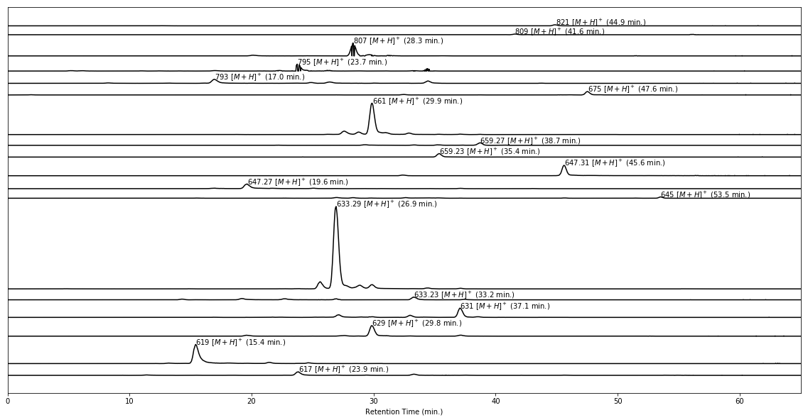
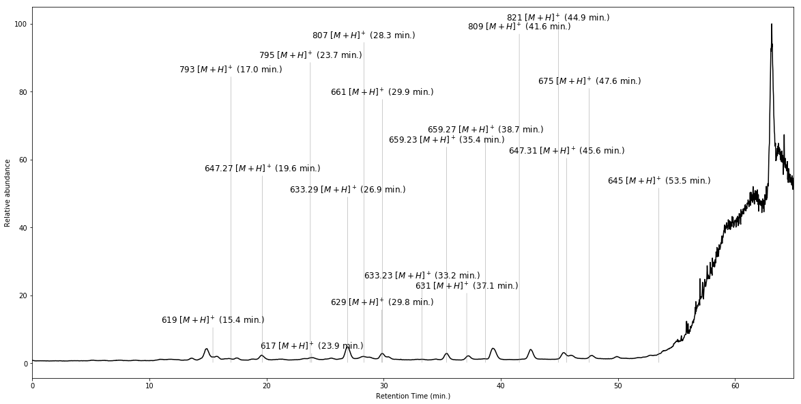

# Generate LC-MS chromatograms for analysis of overlaying effects


```python
def cc(arg):
    return mcolors.to_rgba(arg, alpha=0.6)
```

Detecting peaks from dataset and scaling:


```python
def detect_peaks(x, mph=None, mpd=1, threshold=0, edge='rising',
                 kpsh=False, valley=False, show=False, ax=None):

    """Detect peaks in data based on their amplitude and other features.

    Parameters
    ----------
    x : 1D array_like
        data.
    mph : {None, number}, optional (default = None)
        detect peaks that are greater than minimum peak height.
    mpd : positive integer, optional (default = 1)
        detect peaks that are at least separated by minimum peak distance (in
        number of data).
    threshold : positive number, optional (default = 0)
        detect peaks (valleys) that are greater (smaller) than `threshold`
        in relation to their immediate neighbors.
    edge : {None, 'rising', 'falling', 'both'}, optional (default = 'rising')
        for a flat peak, keep only the rising edge ('rising'), only the
        falling edge ('falling'), both edges ('both'), or don't detect a
        flat peak (None).
    kpsh : bool, optional (default = False)
        keep peaks with same height even if they are closer than `mpd`.
    valley : bool, optional (default = False)
        if True (1), detect valleys (local minima) instead of peaks.
    show : bool, optional (default = False)
        if True (1), plot data in matplotlib figure.
    ax : a matplotlib.axes.Axes instance, optional (default = None).

    Returns
    -------
    ind : 1D array_like
        indeces of the peaks in `x`.

    Notes
    -----
    The detection of valleys instead of peaks is performed internally by simply
    negating the data: `ind_valleys = detect_peaks(-x)`
    
    The function can handle NaN's 

    See this IPython Notebook [1]_.

    References
    ----------
    .. [1] http://nbviewer.ipython.org/github/demotu/BMC/blob/master/notebooks/DetectPeaks.ipynb

    Examples
    --------
    >>> from detect_peaks import detect_peaks
    >>> x = np.random.randn(100)
    >>> x[60:81] = np.nan
    >>> # detect all peaks and plot data
    >>> ind = detect_peaks(x, show=True)
    >>> print(ind)

    >>> x = np.sin(2*np.pi*5*np.linspace(0, 1, 200)) + np.random.randn(200)/5
    >>> # set minimum peak height = 0 and minimum peak distance = 20
    >>> detect_peaks(x, mph=0, mpd=20, show=True)

    >>> x = [0, 1, 0, 2, 0, 3, 0, 2, 0, 1, 0]
    >>> # set minimum peak distance = 2
    >>> detect_peaks(x, mpd=2, show=True)

    >>> x = np.sin(2*np.pi*5*np.linspace(0, 1, 200)) + np.random.randn(200)/5
    >>> # detection of valleys instead of peaks
    >>> detect_peaks(x, mph=0, mpd=20, valley=True, show=True)

    >>> x = [0, 1, 1, 0, 1, 1, 0]
    >>> # detect both edges
    >>> detect_peaks(x, edge='both', show=True)

    >>> x = [-2, 1, -2, 2, 1, 1, 3, 0]
    >>> # set threshold = 2
    >>> detect_peaks(x, threshold = 2, show=True)
    """

    x = np.atleast_1d(x).astype('float64')
    if x.size < 3:
        return np.array([], dtype=int)
    if valley:
        x = -x
    # find indices of all peaks
    dx = x[1:] - x[:-1]
    # handle NaN's
    indnan = np.where(np.isnan(x))[0]
    if indnan.size:
        x[indnan] = np.inf
        dx[np.where(np.isnan(dx))[0]] = np.inf
    ine, ire, ife = np.array([[], [], []], dtype=int)
    if not edge:
        ine = np.where((np.hstack((dx, 0)) < 0) & (np.hstack((0, dx)) > 0))[0]
    else:
        if edge.lower() in ['rising', 'both']:
            ire = np.where((np.hstack((dx, 0)) <= 0) & (np.hstack((0, dx)) > 0))[0]
        if edge.lower() in ['falling', 'both']:
            ife = np.where((np.hstack((dx, 0)) < 0) & (np.hstack((0, dx)) >= 0))[0]
    ind = np.unique(np.hstack((ine, ire, ife)))
    # handle NaN's
    if ind.size and indnan.size:
        # NaN's and values close to NaN's cannot be peaks
        ind = ind[np.in1d(ind, np.unique(np.hstack((indnan, indnan-1, indnan+1))), invert=True)]
    # first and last values of x cannot be peaks
    if ind.size and ind[0] == 0:
        ind = ind[1:]
    if ind.size and ind[-1] == x.size-1:
        ind = ind[:-1]
    # remove peaks < minimum peak height
    if ind.size and mph is not None:
        ind = ind[x[ind] >= mph]
    # remove peaks - neighbors < threshold
    if ind.size and threshold > 0:
        dx = np.min(np.vstack([x[ind]-x[ind-1], x[ind]-x[ind+1]]), axis=0)
        ind = np.delete(ind, np.where(dx < threshold)[0])
    # detect small peaks closer than minimum peak distance
    if ind.size and mpd > 1:
        ind = ind[np.argsort(x[ind])][::-1]  # sort ind by peak height
        idel = np.zeros(ind.size, dtype=bool)
        for i in range(ind.size):
            if not idel[i]:
                # keep peaks with the same height if kpsh is True
                idel = idel | (ind >= ind[i] - mpd) & (ind <= ind[i] + mpd) \
                    & (x[ind[i]] > x[ind] if kpsh else True)
                idel[i] = 0  # Keep current peak
        # remove the small peaks and sort back the indices by their occurrence
        ind = np.sort(ind[~idel])

    if show:
        if indnan.size:
            x[indnan] = np.nan
        if valley:
            x = -x
        _plot(x, mph, mpd, threshold, edge, valley, ax, ind)

    return ind


def _plot(x, mph, mpd, threshold, edge, valley, ax, ind):
    """Plot results of the detect_peaks function, see its help."""
    try:
        import matplotlib.pyplot as plt
    except ImportError:
        print('matplotlib is not available.')
    else:
        if ax is None:
            _, ax = plt.subplots(1, 1, figsize=(8, 4))

        ax.plot(x, 'b', lw=1)
        if ind.size:
            label = 'valley' if valley else 'peak'
            label = label + 's' if ind.size > 1 else label
            ax.plot(ind, x[ind], '+', mfc=None, mec='r', mew=2, ms=8,
                    label='%d %s' % (ind.size, label))
            ax.legend(loc='best', framealpha=.5, numpoints=1)
        ax.set_xlim(-.02*x.size, x.size*1.02-1)
        ymin, ymax = x[np.isfinite(x)].min(), x[np.isfinite(x)].max()
        yrange = ymax - ymin if ymax > ymin else 1
        ax.set_ylim(ymin - 0.1*yrange, ymax + 0.1*yrange)
        ax.set_xlabel('Data #', fontsize=14)
        ax.set_ylabel('Amplitude', fontsize=14)
        mode = 'Valley detection' if valley else 'Peak detection'
        ax.set_title("%s (mph=%s, mpd=%d, threshold=%s, edge='%s')"
                     % (mode, str(mph), mpd, str(threshold), edge))
        # plt.grid()
        plt.show()

```

Import needed modules:


```python
import numpy as np
import pandas as pd
import matplotlib.pyplot as plt
from matplotlib import colors as mcolors
from scipy.signal import argrelextrema
from scipy.signal import find_peaks_cwt

from numpy import trapz
```

Load and specify dataset:


```python
data = pd.io.parsers.read_csv("Kuerbis_Analyse_7min_LC-ESI-MS_12min.csv")

helpvalue = ['617', '619', '629', '631', '633.23', '633.29', '645', '647.27', '647.31', '659.23', '659.27', '661', '675', '793', '795', '807', '809', '821']
#helpvalue = ['619', '633.23', '645', '647', '675', '821']

xs = data[['Zeit']].values
xs = np.hstack(xs)

list_x_values = []
list_y_values = []
list_catabolite = []
list_isomer = []
```

Retrieve assumed constants for developing an equilibrium theory (though not working as found out):


```python
ys = 0
i = 0
highest_peak = []

fig = plt.figure(figsize=(20,10))
ax = plt.axes()

area_617 = 0
area_619 = 0
area_631 = 0
area_63329 = 0
area_645 = 0
area_647 = 0
area_659 = 0
area_661 = 0
area_675 = 0
area_793 = 0
area_795 = 0
area_807 = 0
area_809 = 0
area_821 = 0

height_617 = 0
height_619 = 0
height_631 = 0
height_63329 = 0
height_645 = 0
height_647 = 0
height_659 = 0
height_661 = 0
height_675 = 0
height_793 = 0
height_795 = 0
height_807 = 0
height_809 = 0
height_821 = 0

distance_for_integration = 0.1

for h in helpvalue:
    ys = data[[helpvalue[i]]].values
    ys = np.hstack(ys)
    
    highest_peak.append(ys.max())
    
    if (i == 0):
        print(helpvalue[i])
        area_617 = trapz(ys, dx=distance_for_integration)
        height_617 = ys.max()
    elif (i == 1):
        print(helpvalue[i])
        area_619 = trapz(ys, dx=distance_for_integration)
        height_619 = ys.max()
    elif (i == 3):
        print(helpvalue[i])
        area_631 = trapz(ys, dx=distance_for_integration)
        height_631 = ys.max()
    elif (i == 5):
        print(helpvalue[i])
        area_63329 = trapz(ys, dx=distance_for_integration)
        height_63329 = ys.max()
    elif (i == 6):
        print(helpvalue[i])
        area_645 = trapz(ys, dx=distance_for_integration)
        height_645 = ys.max()
    elif (i == 7):
        print(helpvalue[i])
        area_647 = trapz(ys, dx=distance_for_integration)
        height_647 = ys.max()
    elif (i == 10):
        print(helpvalue[i])
        area_659 = trapz(ys, dx=distance_for_integration)
        height_659 = ys.max()
    elif (i == 11):
        print(helpvalue[i])
        area_661 = trapz(ys, dx=distance_for_integration)
        height_661 = ys.max()
    elif (i == 12):
        print(helpvalue[i])
        area_675 = trapz(ys, dx=distance_for_integration)
        height_675 = ys.max()
    elif (i == 13):
        print(helpvalue[i])
        area_793 = trapz(ys, dx=distance_for_integration)
        height_793 = ys.max()
    elif (i == 14):
        print(helpvalue[i])
        area_795 = trapz(ys, dx=distance_for_integration)
        height_795 = ys.max()
    elif (i == 15):
        print(helpvalue[i])
        area_807 = trapz(ys, dx=distance_for_integration)
        height_807 = ys.max()
    elif (i == 16):
        print(helpvalue[i])
        area_809 = trapz(ys, dx=distance_for_integration)
        height_809 = ys.max()
    elif (i == 17):
        print(helpvalue[i])
        area_821 = trapz(ys, dx=distance_for_integration)
        height_821 = ys.max()
    
    i = i+1

Ka_617 = area_631/area_617
Kh_617 = height_631/height_617
Ka_619 = area_63329/area_619
Kh_619 = height_63329/height_619
Ka_645 = area_659/area_645
Kh_645 = height_659/height_645
Ka_647 = area_661/area_647
Kh_647 = height_661/height_647
Ka2_647 = area_675/area_647
Kh2_647 = height_675/height_647
Ka_793 = area_807/area_793
Kh_793 = height_807/height_793
Ka2_793 = area_821/area_793
Kh2_793 = height_821/height_793
Ka_795 = area_809/area_795
Kh_795 = height_809/height_795

print('Ka_617')
print(Ka_617)
print(Kh_617)
print('Ka_619')
print(Ka_619)
print(Kh_619)
print('Ka_645')
print(Ka_645)
print(Kh_645)
print('Ka_647')
print(Ka_647)
print(Kh_647)
print('Ka2_647')
print(Ka2_647)
print(Kh2_647)
print('Ka_793')
print(Ka_793)
print(Kh_793)
print('Ka2_793')
print(Ka2_793)
print(Kh2_793)
print('Ka_795')
print(Ka_795)
print(Kh_795)


highest_peak = np.array(highest_peak).max()

ys = 0
i=0
previous_mass = 0

for h in helpvalue:
    ys = data[[helpvalue[i]]].values
    ys = np.hstack(ys)
    
    y = []
    for x in ys:
        y.append(((x/highest_peak)*100)+previous_mass+10)
    
    y = np.array(y)
    
    previous_mass = y.max()
    x_max_arg = y.argmax()

    #local_maxima = argrelextrema(y, np.greater, order=200)
    #local_maxima = find_peaks_cwt(y, np.arange(1, 350))
    local_maxima = detect_peaks(y, mph=0.04, mpd=350)
    #first_isomer = np.partition(np.array(y).flatten(), -1)[-1]
    #first_isomer = np.round(np.array(np.hstack(y)[local_maxima])).argsort()[-0:]
    #print(first_isomer)
    #y_help = np.sort(y[local_maxima])
    
    line = plt.plot(xs, y, color = 'black', label = h + '[M+H]^+^')
    ax.annotate(xy=(xs[x_max_arg], previous_mass), s = h + r' $[M+H]^+$ ('+str(np.round(xs[x_max_arg], 1))+' min.)')
    
    list_x_values.append(xs[x_max_arg])
    list_y_values.append(previous_mass)
    list_catabolite.append(h)
        
    #u=1
    #for x in xs[local_maxima]:
        #ax.annotate(xy=(x, y[np.where(x)]), s = h + r' $[M+H]^+$-Isomer '+str(u)+' ('+str(np.round(x, 1))+' min.)')
        
        #list_x_values.append(x)
        #list_y_values.append(y[np.where(x)])
        #list_catabolite.append(h)
        #list_isomer.append(u)
        
        #u = u+1
        
    i = i+1

plt.yticks([])
plt.xlabel('Retention Time (min.)')
plt.xlim(0,65)
plt.savefig('Kuerbis_Analyse_Reaktion3h_LC-ESI-MS.png')
plt.show()
```

    617
    619
    631
    633.29
    645
    647.27
    659.27
    661
    675
    793
    795
    807
    809
    821
    Ka_617
    2.04496546098
    2.61835424334
    Ka_619
    3.72894401481
    4.30577315565
    Ka_645
    0.952718937384
    1.90972196983
    Ka_647
    4.46006879328
    6.6850336666
    Ka2_647
    0.50313171312
    0.722832075087
    Ka_793
    0.998319279587
    3.20375262079
    Ka2_793
    0.112793086295
    0.266083083593
    Ka_795
    0.118012120986
    0.093094387365





Load and specify another dataset:


```python
data = pd.io.parsers.read_csv("Kuerbis_Analyse_7min_LC-ESI-MS_12min_Spektrum.csv")

xs = data[['Time']].values
xs = np.hstack(xs)

ys = data[['Intensity']].values
ys = np.hstack(ys)
```

Print whole chromatogram for completion purpose:


```python
fig = plt.figure(figsize=(20,10))
ax = plt.axes()


#ax.annotate(xy=(xs[x_max_arg], previous_mass), s = h + r' $[M+H]^+$ ('+str(np.round(xs[x_max_arg], 1))+' min.)')

highest_peak = np.array(ys).max()
y = []
for z in ys:
    y.append(((z/highest_peak)*100))
ys = y

line = plt.plot(xs, ys, color = 'black', label = '')

highest_peak = np.array(list_y_values).max()
helper = []
for t in list_y_values:
    helper.append(((t/highest_peak)*100))
list_y_values = helper

i = 0
for index in list_x_values:
    h = list_catabolite[i]
    #u = list_isomer[i]
    text = h + r' $[M+H]^+$ ('+str(np.round(index, 1))+' min.)'
    plt.annotate(
            text, xy=(index, 0), xycoords='data',
            xytext=(index, list_y_values[i]), textcoords='data',
            rotation=0, size=12, horizontalalignment='center', verticalalignment='bottom',
            arrowprops=dict(arrowstyle='-', color="#808080", linewidth=0.4, shrinkA=0.05, shrinkB=1))
    i = i+1
        
#ax.annotate(xy=(x, y[np.where(x)]), s = h + r' $[M+H]^+$-Isomer '+str(u)+' ('+str(np.round(x, 1))+' min.)')

plt.xlabel('Retention Time (min.)')
plt.ylabel('Relative abundance')
plt.xlim(0,65)
plt.savefig('Kuerbis_Analyse_Ganzes_Spektrum.png')
plt.show()
```




